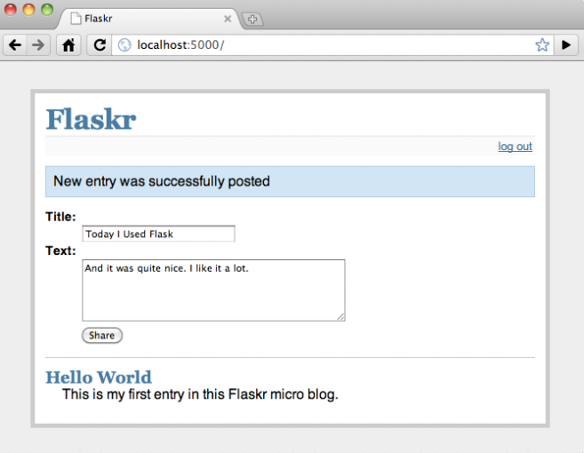

# [Flaskr](http://docs.jinkan.org/docs/flask/tutorial/introduction.html)
Flask demo

1. 允许用户用配置文件里指定的凭证登入登出。只支持一个用户。
2. 当用户登入后，可以向页面添加条目。条目标题是纯文本，正文可以是一些 HTML 。因信任这里的用户，这部分 HTML 不做审查。
3. 页面倒序显示所有条目（后来居上），并且用户登入后可以在此添加新条目。

